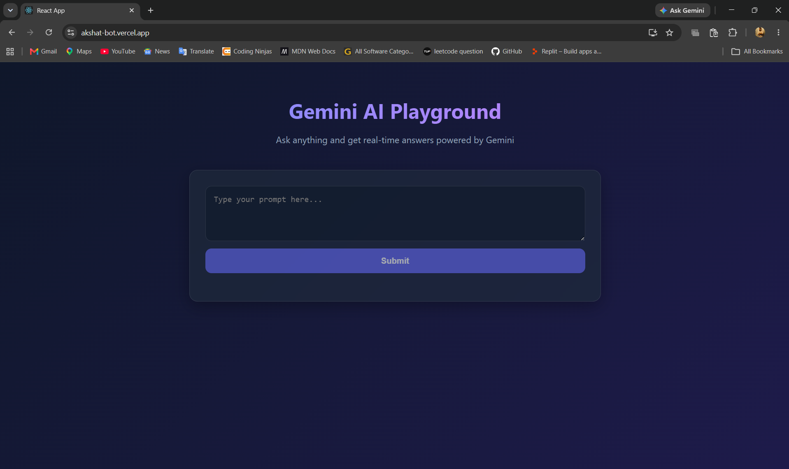
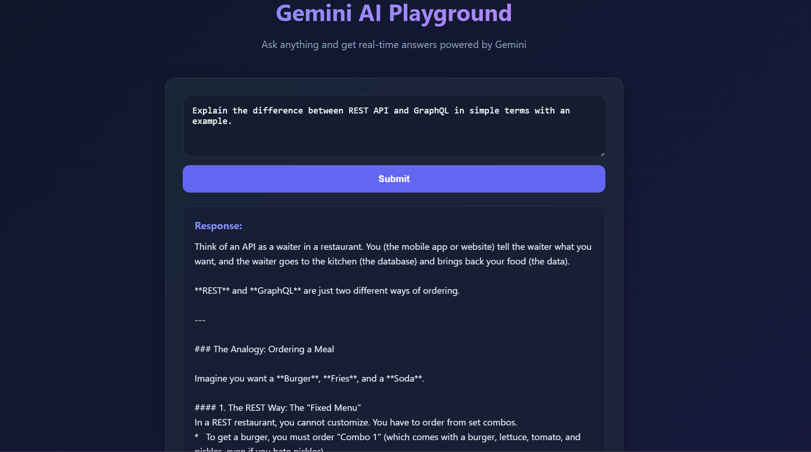

# 🤖 Gemini AI Playground

A modern Full-Stack AI chatbot powered by **Google Gemini API**, built with **React.js**, **Node.js**, and **Express.js**. The application enables users to interact with Google's Gemini AI through a clean, responsive, and user-friendly interface while securely handling API requests on the backend.

---

## 🌐 Live Demo

🚀 **Try it here:** https://YOUR_VERCEL_URL.vercel.app

---

## 📂 Source Code

GitHub Repository:  
https://github.com/akshatpandey4/gemini-bot

---

## ✨ Features

- 🤖 AI-powered conversations using Google Gemini API
- ⚡ Real-time response generation
- 🎨 Modern & responsive user interface
- 🔒 Secure backend API integration
- 📱 Mobile-friendly design
- 🌐 Full-stack architecture
- ☁️ Cloud deployment using Vercel & Render

---

## 🛠️ Tech Stack

### Frontend
- React.js
- HTML5
- CSS3
- JavaScript (ES6)

### Backend
- Node.js
- Express.js

### AI Integration
- Google Gemini API

### Deployment
- Vercel (Frontend)
- Render (Backend)

### Version Control
- Git
- GitHub

---

## 📁 Project Structure

```text
gemini-bot/
│
├── public/
├── src/
├── home.png
├── chat.png
├── server.js
├── package.json
├── package-lock.json
├── .gitignore
└── README.md
```

---

## ⚙️ Installation

### Clone the repository

```bash
git clone https://github.com/akshatpandey4/gemini-bot.git
```

### Navigate into the project

```bash
cd gemini-bot
```

### Install dependencies

```bash
npm install
```

### Create a `.env` file

```env
REACT_APP_GEMINI_API_KEY=YOUR_GEMINI_API_KEY
```

### Start the backend

```bash
node server.js
```

### Start the frontend

```bash
npm start
```

The application will run at:

```text
http://localhost:3000
```

---

## 📸 Screenshots

### 🏠 Home Page

<p align="center">
  
</p>

---

### 💬 AI Response Example

<p align="center">
  
</p>

---

## 🔒 Security

- API keys are stored securely using Environment Variables.
- Sensitive files are excluded through `.gitignore`.
- Backend securely communicates with the Google Gemini API.
- API keys are never exposed in the frontend.

---

## 📚 What I Learned

During this project, I gained hands-on experience with:

- React.js
- Node.js
- Express.js
- REST APIs
- Google Gemini API Integration
- Environment Variables
- Frontend & Backend Communication
- Git & GitHub
- Cloud Deployment (Vercel & Render)

---

## 🚀 Future Improvements

- 👤 User Authentication
- 💾 Chat History
- 🗄️ MongoDB Integration
- 🌙 Dark / Light Theme
- 🎤 Voice Input
- 📎 File Upload Support
- 🖼️ Image Generation
- 📄 Markdown Rendering
- 🔄 Multiple AI Models

---

## 👨‍💻 Author

**Akshat Pandey**

🎓 B.Tech Computer Science & Engineering  
Galgotias University

💻 Full Stack Developer | AI Enthusiast

**GitHub:**  
https://github.com/akshatpandey4

**LinkedIn:**  
https://www.linkedin.com/in/akshatpandey12

---

## ⭐ Support

If you found this project useful, please consider giving it a ⭐ on GitHub.

Feedback and suggestions are always welcome!
